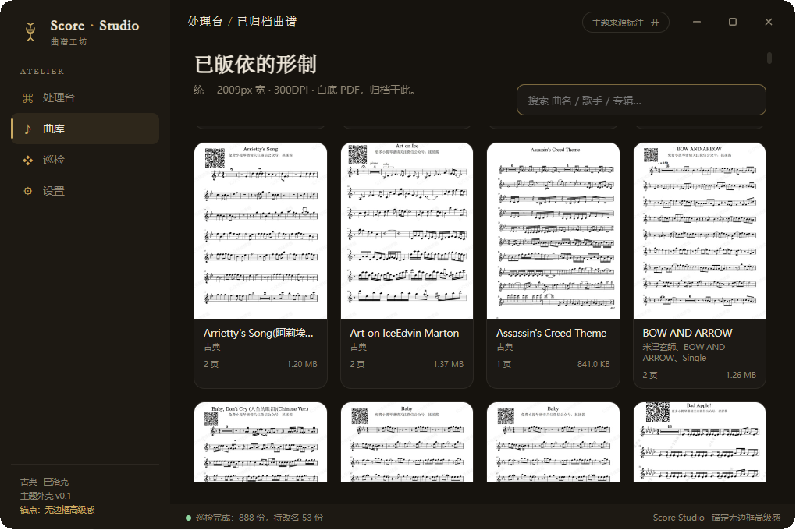
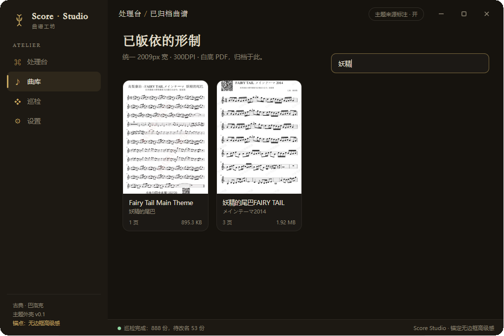
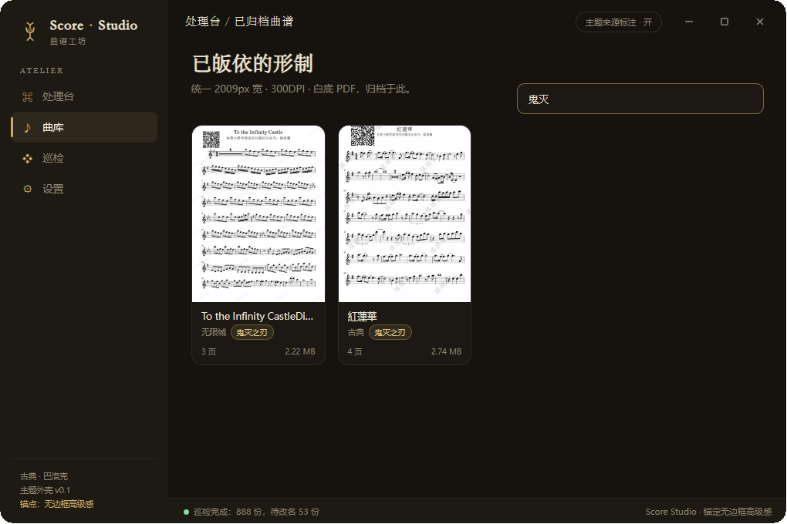
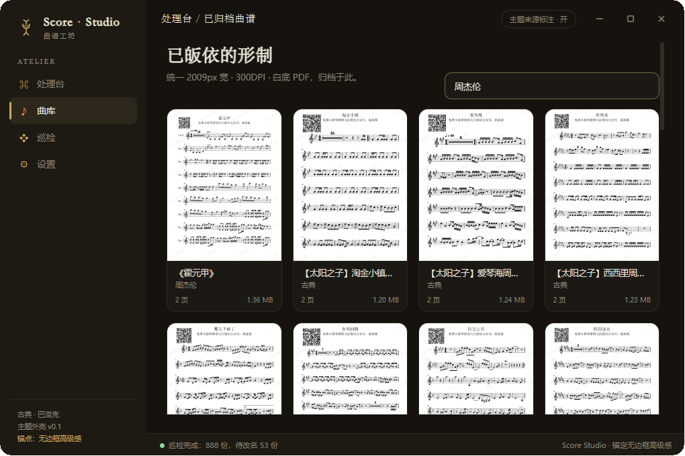

# Score Studio · 曲谱工坊

> 把散落的曲谱皈依为统一形制：**提取（多源链接 / 本地）→ 透明底转白底 → LANCZOS 缩放至 2009px 宽 → 300DPI·95 PDF → 输出至自定义目录**。开箱即用，双击即开。
>
> 外壳主题：**古典 · 巴洛克 & 教堂**，无边框高级感 Flutter 风窗口。

Tauri 2 · Python 子进程管线 · 无边框窗口 · 本地优先

---

## 🎬 成果预览

> 真机截图，作者自用状态（非宣传图，含真实曲谱数据）。

| 处理台 · 皈依为统一形制 | 曲库 · 已皈依的形制墙 |
| :---: | :---: |
|  |  |

| 曲库搜索 · 「妖精」 | 曲库搜索 · 「鬼灭」 | 曲库搜索 · 「周杰伦」 |
| :---: | :---: | :---: |
|  |  |  |

---

## ✨ 核心功能

### I. 处理台 · 多源提取统一形制
从**多源链接 / 本地文件**提取曲谱，一键标准化为 2009px · 300DPI · 白底 PDF。支持：微信公众号（`mmbiz` 高清图）、弹琴吧（`tan8.com` 标准曲谱 + 绿底转白底）、通用网页、本地图片文件夹 / PDF、抖音图文等。

### II. 曲库 · 形制墙
- **真实封面**：PyMuPDF 渲染 PDF 首页缩略图（按 `basename+size+mtime` 缓存）
- **关键词搜索**：曲名 / 歌手 / 专辑任意组合即时过滤
- **点击开 PDF**：卡片点击直接调用系统默认程序打开

### III. 巡检 · 命名规范化
统一「曲名-歌手-专辑」文件名结构：
- **数字 PDF**：PyMuPDF 抽首页文字补名；扫描件：解析文件名 + 标记待人工补名
- **预览优先、绝不静默改**：先展示预览表（当前文件名 / 解析结果 / 建议新名 / 专辑 / 采纳）→ 勾选 → 二次确认 → 才真正重命名
- **联网补全专辑（可选增强）**：iTunes 取证 + 本地中文来源作品兜底（`红莲华 → 鬼灭之刃`、`前前前世 → 你的名字`），离线优雅降级，不阻塞主流程
- **专辑可手填**：双击专辑列直接输入中文名，建议新名实时重算

### IV. 无边框高级感窗口
真·无边框（16px 圆角 + 金箔细边 + 弥散阴影），巴洛克古典主题，页面切换无交界线。

---

## 🚀 快速开始

### 下载与启动
| 形式 | 适合 | 说明 |
| --- | --- | --- |
| **Windows 安装包** `Score Studio_0.1.0_x64-setup.exe` | 想放开始菜单 / 卸载列表 | 自动写入开始菜单 / 卸载项 |
| **便携 zip** `Score-Studio-Portable_x64.zip` | 绿色便携、拷 U 盘 | 解压后直接双击 `score-studio.exe`，不写注册表 |

1. 去 [Releases](https://github.com/LinnnnYue/score-studio/releases) 下载最新版本
2. **安装包**：双击 → 一路 Next → 开始菜单出现图标
3. **便携 zip**：解压 → 双击 `score-studio.exe` 即可

> 应用自带 Python 运行时与全部依赖，**用户机器无需预装 Python**；若检测到系统已有完整 Python 则自动复用。

### 典型工作流
1. **处理**：把微信文章 / 弹琴吧链接或本地曲谱图片拖进处理台 → 一键生成统一形制 PDF
2. **曲库**：浏览输出目录 PDF 墙，关键词即搜即得
3. **巡检**：扫描曲谱库 → 预览建议名（含中文专辑）→ 勾选 → 二次确认 → 重命名
4. **联网补全**：批量补全中文专辑，进度实时显示

---

## 🛠️ 技术栈

- **桌面框架**：Tauri 2（Rust 后端 + WebView2）
- **PDF 管线**：Python 子进程（PyMuPDF / Pillow / numpy）
- **前端**：原生 JS/CSS/HTML（巴洛克古典主题）
- **窗口形态**：无边框 + 圆角裁剪（`SetWindowRgn`）+ 金箔细边

本地优先，所有处理在本机完成；仅「联网补全专辑」需联网（iTunes 取证，失败自动降级本地词库）。

---

## ⚙️ 处理参数（默认值）

| 项 | 值 |
|---|---|
| 目标宽度 | 2009 px |
| 缩放算法 | LANCZOS |
| 输出分辨率 | 300 DPI |
| PDF 质量 | 95 |
| 透明底→白底 | 开 |
| 文件名规则 | 曲名-歌手-专辑 |

---

## 💖 支持作者

> 曲谱工坊为非商业个人项目，作者长期维护与迭代。如果您觉得它对您有帮助，欢迎打赏支持继续开发。

**微信收款**（扫码支持作者）：

**爱发电**（持续支持）：[小凛酱丷 的爱发电主页](https://afdian.com/a/LinnYue)

---

## 📄 关于

- 完整使用预览：见 [docs/SUPPORT.md](docs/SUPPORT.md)
- 作者：**小凛酱丷**
- 反馈与建议：欢迎在仓库提交 [Issue](https://github.com/LinnnnYue/score-studio/issues)
